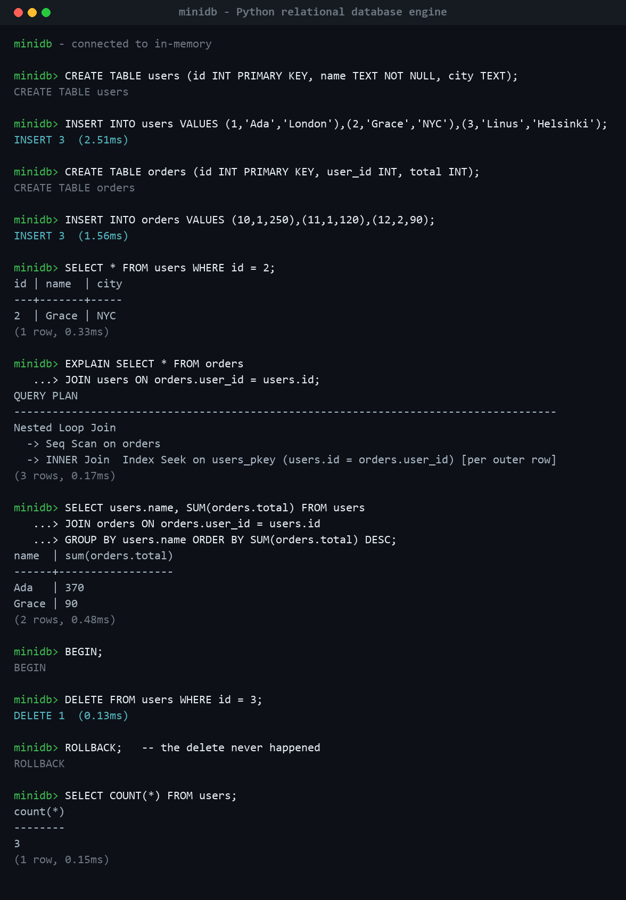

# minidb

**A small but *real* relational database engine, written from scratch in pure Python — no `sqlite3`, no ORM, no dependencies.**

Use it three ways: as an **embedded library**, through a standard **DB-API 2.0**
driver (like `sqlite3`), or as a **networked server** many clients share.

[](https://github.com/Tariqbaloch786/minidb/actions/workflows/ci.yml)


minidb implements the pieces a database course spends a semester on — a paged
storage engine, a **B+Tree** index, a **write-ahead log with crash recovery**, **per-page checksums**, a bounded
**buffer pool**, **overflow pages** for large values, a hand-written **SQL parser**, a **query planner**, **`INNER` / `LEFT` joins** with
an index-nested-loop strategy, **secondary indexes** (`CREATE INDEX`),
**aggregation** (`GROUP BY` / `HAVING`), **parameterized queries**, and **MVCC
transactions** — in ~4,100 lines of dependency-free, tested Python. On top of the
engine sit a **DB-API 2.0 driver** and a **client/server** so applications can
actually use it.

> **Where it fits.** minidb is a **SQLite-class** engine: excellent for embedded
> apps, internal tools, prototypes, tests, teaching, and small shared services.
> Like SQLite, it serializes writes (one writer at a time) with MVCC snapshot
> reads. It is **not** a drop-in replacement for Postgres/MySQL at high write
> concurrency — that (and the roadmap below) is deliberately out of scope. The
> docs say plainly what it does and doesn't guarantee.

<p align="center">
  
</p>

<p align="center"><em>A real <code>minidb</code> session — joins, an <code>EXPLAIN</code>ed index-nested-loop plan, a <code>GROUP&nbsp;BY</code> aggregate, and a rolled-back transaction.</em></p>

---

## Why this project exists

Most "database" projects on GitHub are a schema and an ORM. This one is the
engine *underneath* an ORM. It's built to answer questions like:

- How does a database survive `kill -9` in the middle of a write? *(write-ahead log + redo recovery)*
- Why is `WHERE id = 5` fast but `WHERE name = 'x'` slow? *(B+Tree index seek vs. sequential scan — the planner picks)*
- What actually happens on `ROLLBACK`? *(buffered pages are discarded; committed data is never touched)*
- How can two transactions read the same row and see different values? *(MVCC version chains + snapshot visibility)*

Every one of those is implemented here and covered by a test.

## Architecture

```text
                 ┌──────────────────────────────────────────────┐
   SQL text ───▶ │  sql/   tokenizer → parser → AST             │
                 └──────────────────────────────────────────────┘
                                    │  statement
                                    ▼
                 ┌──────────────────────────────────────────────┐
                 │  engine/ planner (access path) → executor     │
                 │          catalog (schemas)   types (rows)     │
                 └──────────────────────────────────────────────┘
                          │ read/write versioned rows
                          ▼
                 ┌──────────────────────────────────────────────┐
                 │  txn/  MVCC: version chains + snapshot rules   │
                 └──────────────────────────────────────────────┘
                          │ get/put(key, bytes)
                          ▼
                 ┌──────────────────────────────────────────────┐
                 │  storage/ B+Tree  →  Pager  →  single file     │
                 │           WAL (redo log + crash recovery)      │
                 └──────────────────────────────────────────────┘
```

The whole database — user rows, indexes, *and* the system catalog — lives in a
single file divided into 4 KiB pages, exactly like SQLite or Postgres. A second
`.wal` file guarantees durability and atomicity.

| Layer | File | Responsibility |
|-------|------|----------------|
| Pager | [`storage/pager.py`](minidb/storage/pager.py) | Checksummed physical page I/O (CRC + page-id per page), allocation, free list; raises `CorruptionError` |
| Buffer pool | [`storage/buffer_pool.py`](minidb/storage/buffer_pool.py) | Bounded LRU cache, pin/unpin, dirty tracking, hit/miss stats, no-steal buffering |
| WAL | [`storage/wal.py`](minidb/storage/wal.py) | Redo logging, `fsync` on commit, crash recovery, CRC-checked records |
| B+Tree | [`storage/btree.py`](minidb/storage/btree.py) | Ordered index over `int` **or** `bytes` keys; point/range/full scans; splits, delete rebalancing, `validate()`; overflow chains for values larger than a page |
| Indexes | [`engine/index.py`](minidb/engine/index.py) | Secondary indexes: order-preserving key encoding, unique/non-unique, maintenance |
| Tokenizer/Parser | [`sql/`](minidb/sql/) | Hand-written lexer + recursive-descent parser → typed AST |
| Catalog | [`engine/catalog.py`](minidb/engine/catalog.py) | Table **and index** schemas, persisted inside the DB file |
| Planner | [`engine/planner.py`](minidb/engine/planner.py) | Turns `WHERE` into an index seek / range scan / seq scan + residual filter |
| Executor | [`engine/executor.py`](minidb/engine/executor.py) | Runs statements, evaluates predicates (3-valued logic), nested-loop + index joins, writes row versions |
| MVCC | [`txn/mvcc.py`](minidb/txn/mvcc.py) | Version chains, `xmin`/`xmax` visibility, snapshot isolation, vacuum |
| Facade | [`database.py`](minidb/database.py) | `Database.execute(sql, params)`, transaction lifecycle, commit/rollback |
| DB-API 2.0 | [`dbapi.py`](minidb/dbapi.py) | PEP 249 driver: `connect`, cursors, `fetch*`, exception hierarchy |
| Server / Client | [`server.py`](minidb/server.py) · [`client.py`](minidb/client.py) | Threaded TCP server (JSON protocol) + client so many apps share one DB |

There's a fuller write-up in [`docs/ARCHITECTURE.md`](docs/ARCHITECTURE.md).

## Quickstart

No install needed — there are zero dependencies.

```bash
git clone https://github.com/Tariqbaloch786/minidb.git
cd minidb

# interactive shell (in-memory, or pass a file to persist)
python -m minidb
python -m minidb mydata.db

# run the guided demo
python examples/demo.py
```

Or use it as a library:

```python
from minidb import Database

db = Database("app.db")          # or ":memory:"
db.execute("CREATE TABLE t (id INT PRIMARY KEY, name TEXT)")
db.execute("INSERT INTO t VALUES (1, 'ada'), (2, 'grace')")

rows = db.execute("SELECT name FROM t WHERE id = 2").rows
print(rows)                       # [['grace']]

with_txn = db.execute("BEGIN")
db.execute("DELETE FROM t WHERE id = 1")
db.execute("ROLLBACK")            # id=1 is back
db.close()
```

## Installed as a package

```bash
pip install -e .
minidb mydata.db          # interactive shell
minidb-server mydata.db   # start the TCP server
```

## Using it from an application (DB-API 2.0)

minidb ships a [PEP 249](https://peps.python.org/pep-0249/) driver, so it looks
exactly like `sqlite3` to application code and tooling:

```python
import minidb.dbapi as db

conn = db.connect("app.db")
cur = conn.cursor()
cur.execute("CREATE TABLE users (id INT PRIMARY KEY, name TEXT, email TEXT)")
cur.executemany(
    "INSERT INTO users VALUES (?, ?, ?)",
    [(1, "ada", "ada@x.io"), (2, "grace", "grace@x.io")],
)
conn.commit()

cur.execute("SELECT name FROM users WHERE id = ?", (1,))
print(cur.fetchone())          # ('ada',)
conn.close()
```

`connect`, `Cursor`, `execute` / `executemany`, `fetchone/many/all`,
`description`, `rowcount`, `commit` / `rollback`, the full PEP 249 exception
hierarchy (`IntegrityError`, `ProgrammingError`, …), and `with` support are all
there. Transactions are **not** autocommit, per the spec.

## Parameterized queries (SQL-injection safe)

Values passed as `?` parameters are bound *after* parsing, so user input never
becomes part of the SQL text — there is no injection surface:

```python
# the string below is treated purely as data, never as SQL
cur.execute("SELECT * FROM users WHERE name = ?", ("robert'); DROP TABLE users;--",))
```

## Aggregation

`COUNT` / `SUM` / `AVG` / `MIN` / `MAX`, with `GROUP BY` and `HAVING`:

```sql
SELECT region, COUNT(*), SUM(amount)
    FROM sales
    GROUP BY region
    HAVING SUM(amount) > 1000
    ORDER BY SUM(amount) DESC;
```

`COUNT(col)` and the other aggregates ignore `NULL`s (SQL semantics);
`COUNT(*)` counts rows.

## Running it as a server

Start the server (embedded in-memory, or backed by a file):

```bash
minidb-server data.db --host 127.0.0.1 --port 4321
```

Connect from Python (or any language — the protocol is newline-delimited JSON):

```python
from minidb.client import connect

c = connect("127.0.0.1", 4321)
c.execute("CREATE TABLE t (id INT PRIMARY KEY, v TEXT)")
c.execute("INSERT INTO t VALUES (?, ?)", (1, "hello"))
print(c.execute("SELECT * FROM t")["rows"])   # [[1, 'hello']]
c.close()
```

Many clients share one database. Access is serialized under a global lock (the
SQLite model), and transactions are per-connection: a client that runs `BEGIN`
owns the write path until it `COMMIT`s/`ROLLBACK`s (or disconnects, which rolls
back), while other writers are told the database is locked.

## Supported SQL

```sql
CREATE TABLE t (id INT PRIMARY KEY, name TEXT NOT NULL, score FLOAT);
DROP TABLE t;

CREATE [UNIQUE] INDEX idx_name ON t (col[, col...]);
DROP INDEX idx_name;

INSERT INTO t [(cols...)] VALUES (...), (...);

SELECT * | [table.]col, ... | table.* | COUNT(*) | SUM(col) | AVG/MIN/MAX(col)
    FROM t
    [ [INNER | LEFT] JOIN other ON <predicate> ]...
    [WHERE <predicate>]
    [GROUP BY [table.]col, ...]
    [HAVING <predicate over aggregates>]
    [ORDER BY [table.]col | AGG(col) [ASC|DESC]]
    [LIMIT n];

UPDATE t SET col = val, ... [WHERE <predicate>];
DELETE FROM t [WHERE <predicate>];

BEGIN;  COMMIT;  ROLLBACK;
EXPLAIN SELECT ...;              -- show the chosen access path

-- values may be passed as ? parameters (bound safely, never interpolated)
INSERT INTO t VALUES (?, ?);
```

- **Types:** `INT`, `FLOAT`, `TEXT`, with `NULL`.
- **Predicates:** `=  !=  <  <=  >  >=` (column-to-literal *and* column-to-column), combined with `AND` / `OR` / `NOT` and parentheses, evaluated with proper SQL three-valued logic (a comparison against `NULL` is *unknown*, not false).
- **Joins:** `INNER` and `LEFT` joins, chainable across many tables, with `table.column` qualification and ambiguous-name detection.
- **Constraints:** exactly one `INT PRIMARY KEY` (it *is* the clustered B+Tree key), plus `NOT NULL`.

## The query planner in action

```sql
EXPLAIN SELECT * FROM users WHERE id = 42;
-- Index Seek on users_pkey (id = 42)

EXPLAIN SELECT * FROM users WHERE id >= 10 AND id <= 20;
-- Index Range Scan on users_pkey (10 <= id <= 20)

EXPLAIN SELECT * FROM users WHERE name = 'ada';
-- Seq Scan on users  [filter]
```

The planner splits a `WHERE` clause into conjuncts, pushes any primary-key
bounds down into a B+Tree seek or range scan, and keeps the rest as a residual
filter. That single optimization is the difference between the two numbers
below.

## Secondary indexes

By default the primary key is the only index, so `WHERE email = ...` is a
sequential scan. Add a secondary index and the planner switches to an index
scan:

```sql
CREATE INDEX idx_email ON users(email);
CREATE UNIQUE INDEX idx_sku ON products(sku);   -- enforces uniqueness

EXPLAIN SELECT * FROM users WHERE email = 'ada@x.io';
-- Index Scan on idx_email (email = 'ada@x.io')  [filter]
```

Indexes support **equality and range** scans (`=`, `<`, `<=`, `>`, `>=`),
`UNIQUE` and non-unique, and single- or multi-column keys. They're a second
B+Tree keyed on an **order-preserving encoding** of the value (so `bytes`
comparison matches SQL order — that's what makes range scans work for `TEXT` and
`FLOAT`, not just integers), with the row's primary key appended. Index entries
are treated as *candidates* and re-checked against the visible row, so they stay
correct under MVCC; they're maintained automatically on `INSERT` / `UPDATE`.

## Joins

`INNER` and `LEFT` joins work, chainable across any number of tables, with
`table.column` qualification (and an error if you leave an ambiguous name
unqualified):

```sql
SELECT users.name, orders.total
    FROM users
    JOIN orders ON users.id = orders.user_id
    WHERE orders.total >= 100
    ORDER BY orders.total DESC;

-- LEFT JOIN keeps users who have never ordered, with NULLs on the right side
SELECT users.name, orders.total
    FROM users LEFT JOIN orders ON orders.user_id = users.id;
```

The executor runs a **nested-loop join**, but when the `ON` clause is an
equi-join against the inner table's primary key it upgrades to an **index
nested-loop join** — a B+Tree seek per outer row instead of a full inner scan.
`EXPLAIN` shows exactly that:

```text
EXPLAIN SELECT * FROM orders JOIN users ON orders.user_id = users.id;
Nested Loop Join
  -> Seq Scan on orders
  -> INNER Join  Index Seek on users_pkey (users.id = orders.user_id) [per outer row]
```

## Benchmarks

Pure-Python and unapologetically so — the point is *shape*, not raw speed.
Measured on a laptop, 20,000 rows (`python benchmarks/bench.py --disk`):

| Operation | Throughput / latency |
|-----------|----------------------|
| Bulk insert (one transaction) | ~6,700 rows/sec |
| Primary-key point lookups (index seek) | ~12,000 lookups/sec |
| Range scan, 100 rows via index | **0.9 ms** |
| Full sequential scan + filter (20k rows) | 94 ms |

The last two rows are the same data: an index range scan is ~**100×** faster
than the sequential scan the planner falls back to when it can't use the key.

## How durability & atomicity work

minidb uses a **WAL-first, force-at-commit** policy:

1. A transaction's page changes stay in the **buffer pool** (dirty, resident).
2. On `COMMIT`, every modified page's after-image is appended to the WAL, a
   `COMMIT` record is written and **`fsync`'d**, and only then are the pages
   flushed to the main file and the WAL checkpointed.

The buffer pool is deliberately **no-steal**: it never writes a dirty
(uncommitted) page to disk, so the WAL is always durable *before* those changes
reach the main file, and `ROLLBACK` is just "drop the dirty frames." It evicts
only clean pages (LRU); if a single transaction's dirty working set exceeds the
pool it stays resident (the pool grows) rather than risk data loss.

That gives two guarantees, both directly tested:

- **Crash *after* the commit record** → recovery replays the logged pages, so
  committed data survives even if the main-file write never happened. *(durability)*
- **Crash *before* the commit record** → the transaction's pages are ignored on
  replay and were never in the main file. *(atomicity)*

See [`test_transactions.py`](tests/test_transactions.py) — the recovery tests
literally build a torn-write scenario and reopen the database.

## Storage reliability: checksums & the buffer pool

Every physical page carries an 8-byte header — a **CRC32 over the page's id and
data**. On every read the pager recomputes the CRC and checks the stored page
id, so a bit-flip, a torn/truncated page, or a misdirected read becomes a
deterministic **`CorruptionError`** instead of silently wrong data. The meta
page is protected the same way.

- **What it protects:** single-byte flips anywhere in a page, a page written to
  the wrong offset, and truncated/short final pages.
- **What it does *not*:** it's an integrity check (CRC32), **not** a
  cryptographic MAC — it won't stop a deliberate attacker who also rewrites the
  checksum; and it doesn't *repair* corruption. WAL redo can heal a damaged page
  if a committed after-image for it is still in the log; otherwise the engine
  refuses to serve it. Logical (semantically-wrong-but-valid) corruption is the
  B+Tree `validate()`'s job, not the checksum's.

Reads and writes go through a **bounded buffer pool** (LRU, configurable via
`Database(path, cache_pages=…)`) that caches pages across transactions, tracks
hits/misses/evictions (`db.cache_stats()`), and supports pin/unpin. See
[`test_pager_checksum.py`](tests/test_pager_checksum.py),
[`test_buffer_pool.py`](tests/test_buffer_pool.py), and
[`test_storage_stress.py`](tests/test_storage_stress.py).

> **Format note:** adding checksums changed the on-disk page format; the file
> magic is now `MDB2`. Databases written by earlier (`MDB1`) versions are not
> readable — this is a young project and the break is intentional and explicit.

## MVCC in one paragraph

Every row is a **version chain**. A write doesn't overwrite — it appends a new
version stamped with the creating transaction id (`xmin`) and retires the old
one with `xmax`. Each transaction reads through a **snapshot** taken when it
began, so it sees a consistent point-in-time view and never another
transaction's uncommitted work. Because only committed transactions' pages ever
reach disk, any version found after a restart is — by construction — committed,
which is why no persistent commit log is needed. *(This build runs a single
active writer at a time; the visibility machinery is the real thing and
multi-writer concurrency is the documented next step.)*

## Testing

```bash
pip install -e ".[dev]"
pytest                    # 139 tests across every layer
ruff check .              # lint
```

The suite covers the B+Tree (including multi-level splits, delete rebalancing,
and randomized fuzz), the tokenizer/parser, end-to-end SQL and constraints, the
planner's access-path choices, secondary indexes, `INNER` / `LEFT` / multi-table
joins, aggregation with `GROUP BY` / `HAVING`, parameter binding and injection
safety, the DB-API 2.0 driver, the client/server (including the cross-connection
transaction lock), **overflow pages** for large values (up to ~1 MiB, with
reuse), **page checksums and corruption detection** (single-byte,
per-region, truncation, bad headers, invalid page ids), the **buffer pool**
(hits/misses, LRU eviction, pinning, dirty handling, WAL interaction), a
**CRUD stress test under forced eviction**, transaction rollback, durability
across reopen, MVCC visibility, and both crash-recovery directions. CI runs it
on Linux and Windows across Python 3.10–3.12.

## Project layout

```text
minidb/
  storage/   pager.py  buffer_pool.py  wal.py  btree.py
  sql/       tokenizer.py  ast.py  parser.py
  engine/    catalog.py  types.py  planner.py  executor.py  index.py
  txn/       mvcc.py
  database.py  dbapi.py  server.py  client.py  repl.py  __main__.py
tests/       test_btree.py  test_parser.py  test_sql.py  test_joins.py
             test_aggregation.py  test_dbapi.py  test_server.py  test_transactions.py
             test_btree_delete.py  test_indexes.py  test_pager_checksum.py
             test_buffer_pool.py  test_storage_stress.py  test_overflow.py
benchmarks/  bench.py
examples/    demo.py  tour.sql
docs/        ARCHITECTURE.md
```

## Roadmap

Deliberately out of scope for v0.1, and each a fun next step:

- [x] Secondary indexes — `CREATE [UNIQUE] INDEX` / `DROP INDEX`, equality + range scans, planner selection, order-preserving key encoding
- [ ] Multi-writer concurrency with row/page-level locking (today: serialized writes)
- [ ] `RIGHT` / `FULL` joins and a hash-join strategy for non-PK equi-joins
- [ ] More SQL surface: `DISTINCT`, `LIKE`, subqueries, `ALTER TABLE`
- [x] B+Tree delete rebalancing (merge / redistribute / root-collapse) with a `validate()` invariant and randomized fuzz tests
- [x] Page checksums + deterministic corruption detection (`CorruptionError`)
- [x] Bounded buffer pool (LRU eviction, pin/unpin, hit/miss stats, no-steal + WAL ordering)
- [ ] `RIGHT` / `FULL` joins; a hash-join strategy
- [ ] Overflow pages for values larger than one page
- [ ] A cost-based planner using table statistics

## License

MIT — see [LICENSE](LICENSE).
